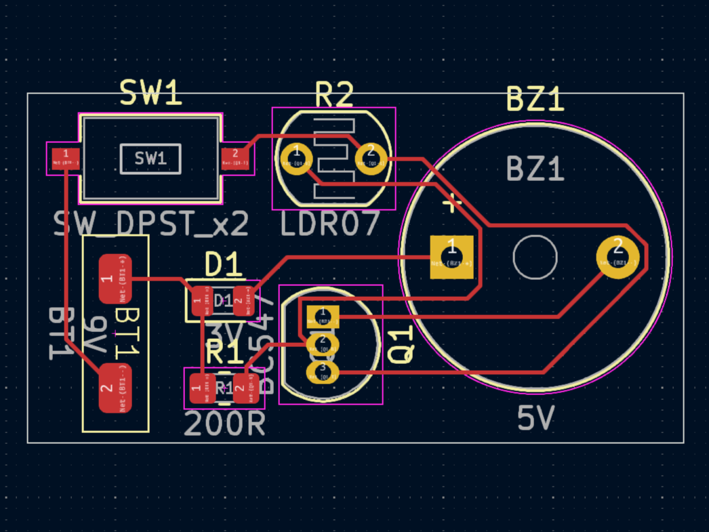

<h1 align="center">Light-Dependent-Resistor Sensor</h1>

A simple but efficient LDR sensor PCB. This PCB is made for light-sensitive applications at small scale.

## ⚡ Preview

<table>
  <tr>
    <td>
      
    </td>
    <td>
      
    </td>
  </tr>
</table>

## 🚀 Utilization

- Automatic window blinds
- Laser light security system
- Light-activated fans or doors
- Automatic street lights
- Smart lighting system
- Solar garden lights
- Energy saving system
- Smart curtains

> [!NOTE]  
> This PCB is suitable for personal projects. Significant modifications are needed for real-world or industrial applications.

## ⚙️ Requirements

- LDR
- Buzzer
- LED
- BC547 Transistor
- 200Ohm Resistor
- 9V power supply

## 📦 Installation and Setup

### Clone the repository

    git clone https://github.com/karmaniket/LDR_PCB.git
    cd LDR_PCB

### Open in KiCad

- Make desired customizations.
- In some cases you'll need to define custom footprints to match non-standard components.
